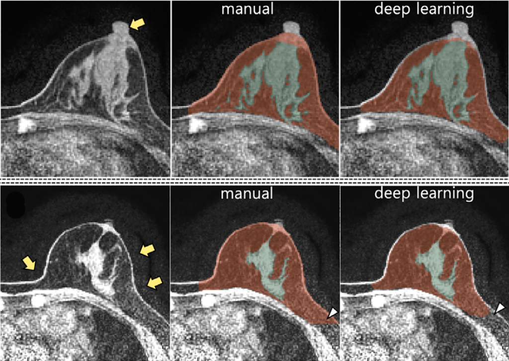

# Fully automatic breast and FGT segmentations on T1-weighted MR images

This repository provides the trained CNN model and the [inference code](FGTSeg_test.ipynb) for 3D whole breast and fibroglandular tissue(FGT) segmentation in fat saturated T1-weighted breast MRI. The automated segmentation model was trained using the [V-Net](https://arxiv.org/abs/1606.04797) architecture. The model outputs the segmentation results as a 1.5 mm isotropic voxel. If you want to see the results for the 1mm isotropic voxel, feel free to contact me (Junghwa Kang - kangjung9592@gmail.com).

## References

- *Nam, Y., Park, G. E., Kang, J., & Kim, S. H. Fully Automatic Assessment of Background Parenchymal Enhancement on Breast MRI Using Machine‐Learning Models. Journal of Magnetic Resonance Imaging*. https://doi.org/10.1002/jmri.27429

## Test Environment
- Windows 10
- Python 3.8.5
- Pytorch 1.6.0
- CUDA 10.1
- Both NVIDA TITAN Xp GPU and CPU.

## Required Packages
- nilearn: for nifti format load/save
- torchio: 